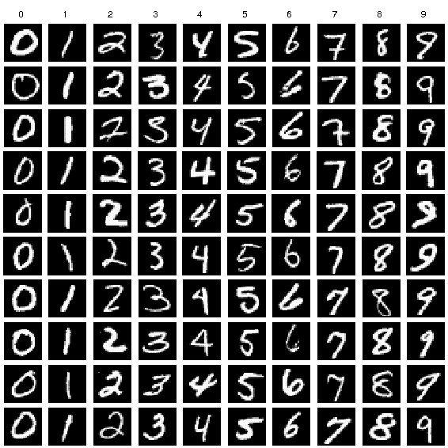

```{r setup, include=FALSE}
knitr::opts_chunk$set(echo = TRUE)
```

To start with you will need to download and install python and then create a virtual environment to run python. Make sure you have git installed. If not got to https://git-scm.com/download/win for installing git on windows or https://git-scm.com/download/mac for MacOS. 
```{r}
library(reticulate)

install_python("3.11:latest") # install latest patch available at python.org

# select the latest 3.11.* patch installed locally
virtualenv_create("r-reticulate", version = "3.11")
use_virtualenv("r-reticulate")
```
The next step is to install `keras3` and `tensorflow`. 

```{r}
install.packages("keras3")
```

```{r}
keras3::install_keras(backend = "tensorflow")
```

Load packages (install any other packages you haven't got already)
```{r}
library(dplyr)        
library(keras3)  
library(dslabs)
library(ramify)
```

## Introduction

Starting in the 1990s, machine learning has quickly become the most popular subfield of AI. This trend has also been driven by the availability of faster computing and a plethora of diverse data sets.<br>
A machine learning algorithm transforms its input data into meaningful outputs by a process known as **representations**. Representations are transformations of the input data, to represent it closer to the expected output.<br>
Conventional machine learning focuses on learning only one or two layers of representations of the input data rendering them insufficient for for solving human perception problems like image classification, text-to-speech translation, handwriting transcription, etc.<br>
In contrast, **deep learning** makes use of tens/hundreds of successive layers of representations. Each hidden layer uses an activation function which carries out the transformation of the data coming from a previous layer. <br>
As a result deep learning is better than conventional machine learning algorithms for these “perceptual” tasks, which has resulted in generating a huge interest in this subfield of AI in recent years. 

## Aim of practical:
In this practical you will learn the fundamentals of building a simple feedforward deep neural network (DNN), which is the foundation for generating more advanced deep learning models.<br>

To build a feedforward DNN we need four key components:

1) Input data
2) A pre-defined network architecture;
3) A feedback mechanism to help the network learn;
4) A model training approach.

During this practical we will go through the four stages of building a DNN using the library `keras3`. 

# Dataset
For the purposes of this practical, we will import the dataset MNIST which is a subset of a larger set available from the National Institute of Standards and Technology (NIST) (http://yann.lecun.com/exdb/mnist/). The MNIST database contains handwritten examples of the 10 digits (0-9) represented as 28x28 grayscale images. It has a training set of 60,000 examples, and a test set of 10,000 examples. See an example in Figure 1.<br>
The MNIST database is widely used for training and testing DNNs to achieve near human performance of handwriting recognition. 


## Data loading

To load the data into R, you can use the `read_minst()`R function from the library `dslabs`:

```{r}
# Import MNIST training data
mnist <- dslabs::read_mnist()
```

## Data preparation

### Task 1: Look into the object `mnist` you created and extract the images and labels for the trainset into two separate variables. Do the same for the test set.  


```{r}
# Training set
mnist_x <- 
mnist_y <- 

# Test set
mnist_test_x <- 
mnist_test_y <- 
```

### Task2: standardize the train and test data by dividing each dataset by 255. 

NOTE: For grayscale images pixel values range between 0-255. Typically zero is taken to be black, and 255 is taken to be white. Values in between make up the different shades of gray. 
```{r}
# Standardise train and test datasets

mnist_x <-

mnist_test_x
  
```


Machine learning models require all input and output variables to be numeric. Since for classification tasks the class variable is categorical, we must encode it to numbers before you can fit and evaluate a model.
Since we are working with a multinomial response (0–9), keras requires our response to be a one-hot encoded matrix, which can be accomplished with the keras function `to_categorical()`. You can find an comrehensive expalantion of how one-hot encoding is performed in this online post https://www.educative.io/blog/one-hot-encoding


### Task 3: convert the vector containing the train set class labels into a matrix with 10 columns, one for each category. 

```{r}
# One-hot encode response 
mnist_y <- to_categorical() # Check help to see how to use the function

mnist_test_y <-to_categorical()
```

### Task 4: Change the column names for the `mnist_y` matrix to be between 0-9. Print the first few rows in the console to see if it has worked. 
```{r}
colnames(mnist_y)<-

colnames(mnist_test_y)<-
```

## Network Architecture

The next stage is to decide the network architecture by defining:
a) the number of layers
b) the number of nodes
c) the activation function(s)

As mentioned during the lecture, the number of input nodes = the number of features, and the number of output nodes = the number of classes (outcomes) which are both fixed. What we need to decide is the number of hidden layers and nodes. 

### Hidden Layers
When dealing with many features and, therefore, many nodes, training deep models with many hidden layers can be computationally more efficient than training a single layer network with the same number of high volume nodes. Consequently, the goal is to find the simplest model with optimal performance.

### Implement architecture
In this example we will create three hidden layers the first with 256 nodes, the second with 128, the third 64 nodes, followed by an output layer with 10 nodes. 
**NOTE** In the first layer we also need to provide  the `input_shape` which is equal the number of features in the dataset (input nodes). We also need to specify the **activation** function in each layer. 

### Task 5: Fill in the missing arguments in the following code, based on the information provided above. Also, provide a suitable activation function for each layer. The first one has been done for you. 

```{r}
model <- keras_model_sequential() %>%
  layer_dense(units = 256, activation = "relu", input_shape = c(784)) %>%
  layer_dense() %>%
  layer_dense() %>%
  layer_dense()

```

Now print the model architecture using the function `summary()`.

```{r}

```

### Backpropagation

Backpropagation is the process of adjusting the weights across all the node connections in the network to improve model accuracy. In backpropagation we need to define the following two parameters:

1) the loss function 
2) the optimizer

The loss function is used to measure performance. For regression problems this is normally the mean squared error (MSE) and for classification problems it is commonly binary and multi-categorical cross entropy, depending on the classification task. 

The optimizer, defines the variant of mini-batch stochastic gradient descent (SGD) applied in the backpropagation process. These variants differ mainly in how fast they descend the gradient (controlled by the learning rate). 

Backpropagation is incorporated within the DNN with the function `compile()`. 

### Task 6: In the following chunk select `categorical_crossentropy` for the loss function, `optimizer_rmsprop()` for the optimizer and `accuracy` metrics.   
```{r}
model %>% compile(
  loss = ,
  optimizer = ,
  metrics = c() 
)
```

## Train the model

Previously we created a base model. In the next step we will train it with the mnist trainset. To do so we feed our model into a `fit()` function along with our training data. We also need to specify some other parameters including:

`batch_size`: We split the trainset into batches of certain size and feed them into the feedforward DNN. Batch size values are typically provided as a power of two that fit into the memory requirements of the GPU or CPU hardware like 32, 64, 128, 256, etc.
`epochs`: An epoch describes the number of times the algorithm sees the entire data set. The more complex the features and relationships in your data, the more epochs will be required for the model to learn, adjust the weights, and minimize the loss function.
`validation_split`: The model will hold out a percentage of the trainet so that we can compute a more accurate estimate of an out-of-sample error rate.
`verbose`: If set to TRUE we can see a live update of the loss function in the RStudio IDE.

### Task 7: Fill in the missing arguments in the following code based on the suggestion provided

```{r}
# Train the model
fit1 <- model %>%
  fit(
    x = ,
    y = ,
    epochs = ,     # Select a value between 20-50
    batch_size = ,
    validation_split = ,    # Select a value between 0.2 to 0.5
    verbose = FALSE
  )
```

```{r}
# Display fit1 output

```

Plot the loss and accuracy results. Use the `plot()` function to see the loss and accuracy changes through successive epochs. 
```{r}

```

## Make predictions

### Task 8: Use the `predict()` function to make predictions for the class of the data in the test set
```{r}
predictions <- model %>% predict()

predictions
```

## Evaluate 
To assess how good the model is at predicting the correct digit we can use the `evaluate()` function.

### Task 9: Fill in the arguments in the function below. The first argument should be the test data and the second the test labels. 

```{r}
evaluation <- model %>% evaluate()
```

What is the accuracy you get?

## Model optimisation

As with conventional ML algorithms, we can take some steps to optimise the performance of DNNs. These often include the following processes:

1) Batch Normalisation
2) Regularisation
3) Learning rate adjustment. 

For the pursposes if this practical we will only apply a form of regularisation process called dropout.  
Dropout is the process of randomly dropping out a number of output features in a layer during training. This helps prevent overfitting. In keras3 we can use the function `layer_dropout(rate=)` to perform feature reduction. 


### Task 10: Add a dropout step after each hidden layer in the model you built earlier. Set the rate to 0.25. Summarise the model and then compile it. Repeat Tasks 7-9 to evaluate the new model. Can you see any improvements in the accuracy and loss?

```{r}
# Recreate the model architecture but with dropout added
model <- keras_model_sequential() %>%
  

```

Now print the new model architecture

```{r}

```

Finally compile the new model

```{r}

```

## Build Confusion Matrix

Now that we have built a final model let's visualise the confusion matrix. 

The first step will be to create a dataframe with the actual and predicted values for the test set.Run the following code to create the dataframe. 
```{r}
library(ramify)

eval_df <- data.frame(
  y = argmax(mnist_test_y),
  y_pred = argmax(predictions)
)
eval_df$y <- lapply(eval_df$y, function(x) x-1)     
eval_df$y_pred <- lapply(eval_df$y_pred, function(x) x-1)

head(eval_df)
```

Now we can create the confusion matrix.

### Task 11: Use the `eval_df` dataframe to extract the actual and predicted classes. Then create a table using the function `table()` with the ACTUAL vs PREDICTED values. 
```{r}
# 1. Use the lapply() function to unlist the eval_df object
eval_df <- lapply()

# 2. Ensure the eval_df is a dataframe

# 3. Use the table() function to create the confusion matrix
table()
```

### Task 12: (Optional) 
If you have time, try the same task as before, but this time change the DNN architecture. You can try 4 hidden layers starting from 512 nodes. You can also play with the parameters of the network, such as different activation functions, different optimizer (optimizer_adam()) and dropout rate. Are you able to get 100% accuracy?